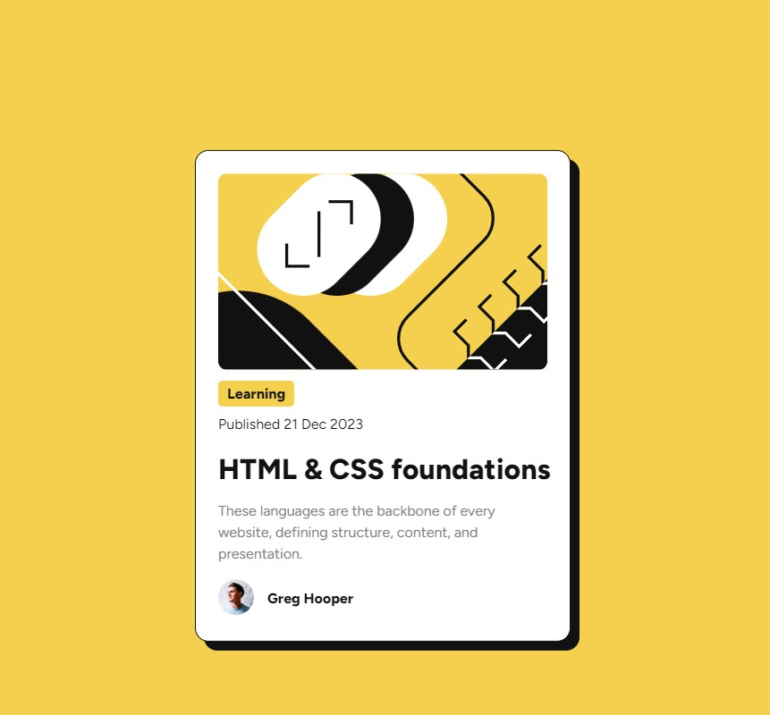

# Frontend Mentor - Blog preview card solution

This is a solution to the [Blog preview card challenge on Frontend Mentor](https://www.frontendmentor.io/challenges/blog-preview-card-ckPaj01IcS). 

## Table of contents

- [Overview](#overview)
- [Screenshot](#screenshot)
- [Links](#links)
- [Built with](#built-with)
- [What I learned](#what-i-learned)
- [Useful resources](#useful-resources)


## Overview
Create a blog preview card with HTML and CSS for practice purposes. 

Users should be able to:

- See hover and focus states for all interactive elements on the page

### Screenshot




### Links

- Live Site URL: [Add live site URL here](https://your-live-site-url.com)

### Built with

- Semantic HTML5 markup
- CSS custom properties
- Flexbox
- CSS Grid

### What I learned

Reinforced how to center a div both horizontally and vertically, like this: 

```css
.card {
  display: flex;
  flex-direction: column;
  position: fixed;
  top: 50%;
  left: 50%;
  transform: translate(-50%, -50%);
  border: 1px solid;
  border-radius: 15px;
  background-color: var(--white);
  width: 420px;
  padding: 25px;
  box-shadow: 10px 10px;
}
```
### Useful resources

- https://fonts.google.com/ [to add the fonts]
